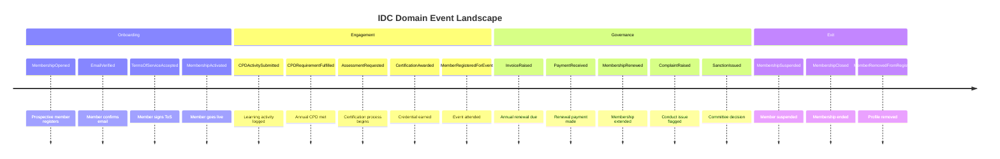

# Session 1: Big Picture Event Storming

## Purpose

Establish a domain-wide map of significant business events — without technical constraints — using unlimited orange stickies on a shared timeline. The goal is shared understanding across domain experts, product owners, and engineers before any design decisions are made.

## Participants

- **Domain Expert** — a current IDC committee member with ten years in the organisation
- **Product Owner** — responsible for the digital member portal
- **Tech Lead** — principal engineer leading the platform build
- **Facilitator** — an external DDD practitioner

## Key Discoveries

The storm surfaced four major phases in the IDC's life:

1. **Onboarding** — a practitioner discovers the IDC, registers, and reaches active status
2. **Engagement** — an active member grows through CPD activities, events, and certifications
3. **Governance** — the IDC enforces its standards through annual renewal and conduct processes
4. **Exit** — a member leaves voluntarily, lapses through non-payment, or is removed

A critical insight emerged mid-session from the domain expert: **the IDC does not consider a member "active" until email, terms of service, and payment have all been confirmed**. This three-gate activation pattern became a recurring constraint across every subsequent session and drove the `open → active` state transition in the Membership aggregate.

A second insight: **suspension and closure are meaningfully different exits**. Suspension is temporary and reversible (e.g. conduct investigation, payment grace period). Closure is permanent. Conflating them into a single terminal state would destroy historical context.

## Artefacts

### Domain Events by Emerging Context

**Membership**
- MembershipOpened
- EmailVerificationSent
- EmailVerified
- EmailVerificationInvalidated
- TermsOfServiceAccepted
- MembershipActivated
- EmailChanged
- AddressChanged
- MembershipRenewed
- MembershipSuspended
- MembershipClosed

**Accreditation**
- AssessmentRequested
- AssessmentScheduled
- AssessmentCompleted
- CertificationAwarded
- CertificationExpired
- CertificationRevoked
- AppealRaised
- AppealDecided

**CPD**
- CPDActivitySubmitted
- CPDActivityApproved
- CPDActivityRejected
- CPDRequirementFulfilled
- CPDPeriodClosed
- CPDRequirementFailed

**Events**
- EventProposed
- EventScheduled
- EventPublished
- RegistrationOpened
- MemberRegisteredForEvent
- AttendanceConfirmed
- EventCancelled
- EventCompleted

**Payments**
- InvoiceRaised
- PaymentReceived
- PaymentFailed
- PaymentRetried
- RefundIssued
- MembershipFeeWaived
- SubscriptionRenewed

**Communications**
- AnnouncementDrafted
- AnnouncementPublished
- NewsletterScheduled
- NewsletterSent

**Notifications**
- NotificationQueued
- NotificationDelivered
- NotificationFailed
- NotificationBounced
- MemberUnsubscribed

**Conduct & Governance**
- ComplaintRaised
- ComplaintInvestigated
- HearingScheduled
- SanctionIssued
- MemberSuspended
- AppealSubmitted
- AppealDecided
- MemberReinstated

**Public Registry**
- MemberListedInRegistry
- MemberProfileUpdated
- MemberRemovedFromRegistry
- CertificationDisplayedOnProfile

## Contested Areas & Alternatives Considered

| Area | Alternative A | Alternative B | Decision |
|------|--------------|--------------|---------|
| Activation gate | Email + ToS only (no payment) | Email + ToS + Payment | Payment gating deferred — Payments BC scoped separately; Membership activates on Email + ToS |
| Suspension vs. closure | Single `closed` state covers all exits | Distinct `suspended` and `closed` states | **Distinct states** — suspension is reversible, closure is not |
| Event naming convention | Mixed tense (`MembershipOpen`, `ActivateMembership`) | Past tense throughout | **Past tense** — events describe facts that happened, not intentions |
| Renewal modelling | Reuse `MembershipActivated` | New `MembershipRenewed` event | **New event** — renewal has different business meaning and carries renewal-period metadata |
| Email verification invalidation | Only invalidate on explicit request | Invalidate immediately on email change | **Immediate invalidation** — active membership with an unverified email is a security risk |

## What This Led To

The event clusters made context boundaries obvious enough to schedule a focused Process Modelling session. The three-gate activation pattern and the suspension/closure distinction were flagged as the first flows to model in detail. See `02-process-modelling.md`.
