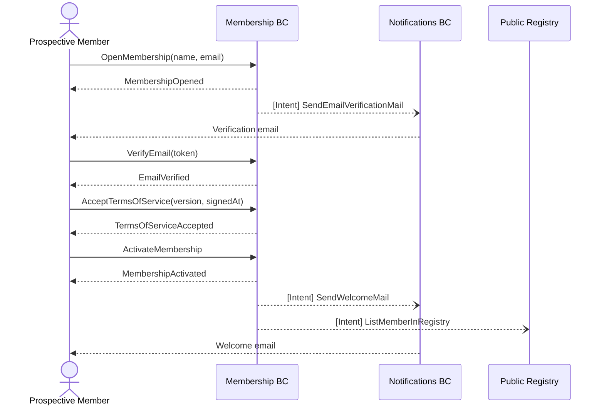
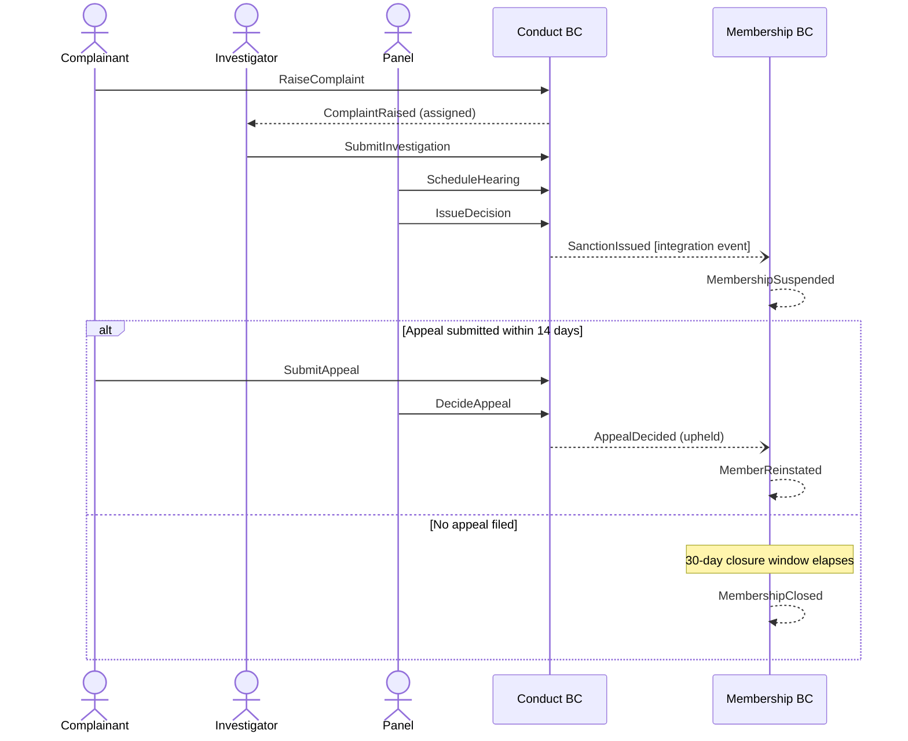

# Session 2: Process Modelling

## Purpose

Add structure to the Big Picture events by introducing swimlanes, actors (yellow), commands (blue), read models (green), and policies (lilac). The goal is to understand *who* triggers what, *what information* is needed, and *what happens automatically* as a result.

## Participants

- **Domain Expert**
- **Product Owner**
- **Tech Lead**
- **UX Designer** — joined for the registration and onboarding flows

## Key Discoveries

- The registration flow has a **multi-step funnel** where each step is an explicit user action. This means partial state (an open, unverified membership) is normal and must be modelled, not treated as an error condition.
- Email change must **restart the verification flow** — a member who changes their email should not retain a verified status from their previous address.
- The conduct process runs **entirely within the Conduct BC** until a sanction is issued; only then does it cross into the Membership BC to suspend or close. This boundary kept the aggregates clean.
- Renewal is triggered by a **time-based policy** in the Payments BC, not by a member action, making it the first example of a system-initiated command.

## Artefacts

### Flow 1: Member Registration and Activation

| Step | Actor | Command | Policy triggered | Event emitted |
|------|-------|---------|-----------------|---------------|
| 1 | Prospective member | `OpenMembership` | Send verification email | `MembershipOpened` |
| 2 | System (policy) | — | On `MembershipOpened` → dispatch intent | `[Intent] SendEmailVerificationMail` |
| 3 | Prospective member | `VerifyEmail` | — | `EmailVerified` |
| 4 | Prospective member | `AcceptTermsOfService` | Validate TOS version is known | `TermsOfServiceAccepted` |
| 5 | Prospective member | `ActivateMembership` | Requires verified email + accepted ToS | `MembershipActivated` |
| 6 | System (policy) | — | On `MembershipActivated` → dispatch intents | `[Intent] SendWelcomeMail`, `[Intent] ListMemberInRegistry` |

### Flow 2: Email Change

| Step | Actor | Command | Policy triggered | Events emitted |
|------|-------|---------|-----------------|----------------|
| 1 | Active/open member | `ChangeEmail` | Invalidate current verification | `EmailChanged`, `EmailVerificationInvalidated` |
| 2 | System (policy) | — | On `EmailChanged` → dispatch intent | `[Intent] SendEmailVerificationMail` |
| 3 | Member | `VerifyEmail` | — | `EmailVerified` |

Note: if the member was `active` when they changed their email, they remain `active` — email re-verification is required for security but does not demote status. However, certain high-trust operations (e.g. requesting a new certification) require a currently verified email.

### Flow 3: Annual Renewal

| Step | Actor | Command | Policy triggered | Events emitted |
|------|-------|---------|-----------------|----------------|
| 1 | System (time policy) | `RaiseInvoice` | 30 days before subscription end | `InvoiceRaised` |
| 2 | Member | — | Pays via payment gateway | `PaymentReceived` |
| 3 | System (policy) | `RenewMembership` | On `PaymentReceived` for renewal invoice | `MembershipRenewed` |
| 4 | System (policy) | — | On payment failure → retry after 3 days (×3) | `PaymentFailed`, `PaymentRetried` |
| 5 | System (policy) | `SuspendMembership` | After 3 failed retries (14-day window) | `MembershipSuspended` |
| 6 | System (policy) | `CloseMembership` | After 30 days suspended with no payment | `MembershipClosed` |

### Flow 4: Conduct Complaint

| Step | Actor | Command | Policy triggered | Events emitted |
|------|-------|---------|-----------------|----------------|
| 1 | Any member | `RaiseComplaint` | Assign investigator | `ComplaintRaised` |
| 2 | Investigator | `SubmitInvestigation` | If serious → schedule hearing | `ComplaintInvestigated` |
| 3 | Committee | `ScheduleHearing` | Notify respondent | `HearingScheduled` |
| 4 | Committee | `IssueDecision` | If sanction → cross-context command to Membership | `SanctionIssued` |
| 5 | System (policy) | `SuspendMembership` | On `SanctionIssued` (via integration event) | `MemberSuspended` |
| 6 | Respondent (optional) | `SubmitAppeal` | Pause enforcement | `AppealSubmitted` |
| 7 | Appeals panel | `DecideAppeal` | If overturned → reinstate member | `AppealDecided`, `MemberReinstated` |

### Flow 5: Certification Assessment

| Step | Actor | Command | Policy triggered | Events emitted |
|------|-------|---------|-----------------|----------------|
| 1 | Active member | `RequestAssessment` | Verify active membership | `AssessmentRequested` |
| 2 | Admin | `ScheduleAssessment` | Notify member | `AssessmentScheduled` |
| 3 | Assessor | `RecordAssessmentResult` | If pass → award certification | `AssessmentCompleted` |
| 4 | System (policy) | `AwardCertification` | On pass result | `CertificationAwarded` |
| 5 | System (policy) | — | On `CertificationAwarded` → update registry | `CertificationDisplayedOnProfile` |

## Contested Areas & Alternatives Considered

| Area | Alternative A | Alternative B | Decision |
|------|--------------|--------------|---------|
| Email change + active status | Demote to `open` pending re-verification | Remain `active`, flag as unverified | **Remain active** — avoids disrupting active members; unverified email is a separate concern |
| Renewal trigger | Member-initiated renewal command | Time-based policy (system-initiated) | **Time-based policy** — reduces member burden; IDC bears responsibility for prompting |
| Conduct cross-context | Conduct BC writes directly to Membership | Conduct publishes integration event, Membership consumes | **Integration event** — preserves context autonomy; Membership controls its own state |
| Certification prerequisite | Active membership required at assessment time only | Active membership required throughout certification validity | **Assessment time only** — a closed member's past certifications are voided separately via a policy |

## What This Led To

The explicit flows gave the team enough context to identify system boundaries and assign aggregate ownership. See `03-software-design.md` for how actors and policies mapped to aggregates and external systems.
