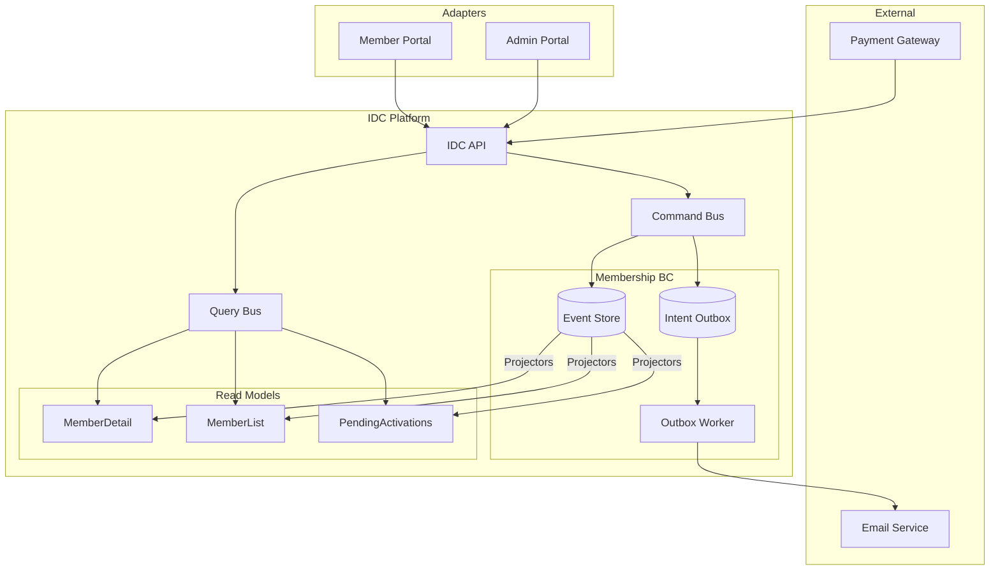

# Session 3: Software Design

## Purpose

Map the process model onto a software architecture: identify aggregates, external systems, read models, and the boundaries between them. Introduce the technical vocabulary (ports and adapters, CQRS, event sourcing) where it maps cleanly to the discovered processes.

## Participants

- **Tech Lead**
- **Domain Expert**
- **Product Owner**
- **Platform Architect** (joined for this session)

## Key Discoveries

- The Membership aggregate is the most complex in the domain — it has the richest state machine, the most commands, and the most cross-context interactions. It is the right place to demonstrate event sourcing and the Decider pattern.
- **Read models and write models diverge sharply**. The command side needs only the current aggregate state to make decisions; the query side needs denormalised projections optimised for display.
- The `Intent` concept emerged as a design pattern: some commands must produce side effects (send an email, update the registry) that cross context boundaries. These are modelled as *intents* emitted alongside events, routed through an outbox to outbound adapters. This keeps the aggregate pure.
- Two external systems drive significant complexity: the **Email Service** (for verification and notifications) and the **Payment Gateway** (for renewal billing). Both are treated as external — the IDC platform adapts to them, not the other way around.

## Artefacts

### External Systems

| System | Role | Integration pattern |
|--------|------|---------------------|
| Email Service (e.g. SendGrid) | Delivers transactional email | Outbound adapter; receives intents from Notifications BC via outbox |
| Payment Gateway (e.g. Stripe) | Processes membership fees | Outbound adapter; webhooks drive `PaymentReceived` / `PaymentFailed` events into Payments BC |
| Member Portal (web app) | Primary member-facing interface | Inbound HTTP adapter; sends commands, reads projections |
| Admin Portal (back-office) | Staff interface for membership management | Inbound HTTP adapter; elevated command permissions |

### Aggregates by Bounded Context

| Context | Aggregate | Persistence | Notes |
|---------|-----------|-------------|-------|
| Membership | `Membership` | Event-sourced | State derived entirely from events via `evolve` |
| Accreditation | `Certification`, `Assessment` | Event-sourced | Certification validity is a projection over assessment events |
| CPD | `CPDRecord` | Event-sourced | One record per member per CPD period |
| Events | `Event`, `Registration` | State-based | High read volume; event sourcing adds unnecessary complexity here |
| Payments | `Invoice`, `Subscription` | State-based | Stripe is the system of record; IDC stores a mirror |
| Communications | `Announcement`, `Newsletter` | State-based | Content management pattern, not transactional |
| Notifications | `Notification` | Append-only log | Delivery status tracked per attempt |
| Conduct | `Complaint`, `Hearing` | Event-sourced | Full audit trail required for legal defensibility |
| Public Registry | `MemberProfile` | Projection | Read-only; rebuilt from Membership and Accreditation events |

### Read Models

| Read model | Source context | Consumer | Purpose |
|------------|---------------|----------|---------|
| `MemberDetail` | Membership | Member Portal | Display member's own profile and status |
| `MemberList` | Membership | Admin Portal | Paginated list with status filters |
| `PendingActivations` | Membership | Admin Portal | Members in `open` state pending activation |
| `CertificationsByMember` | Accreditation | Member Portal, Registry | Display earned certifications |
| `CPDProgress` | CPD | Member Portal | Progress toward annual CPD requirement |
| `UpcomingEvents` | Events | Member Portal | Personalised event recommendations |
| `OpenComplaints` | Conduct | Admin Portal | Active conduct cases with status |
| `PublicMemberProfile` | Registry | Public web | Publicly searchable member and certification data |

### Key Architectural Decisions

1. **Decider pattern for Membership** — `decide(command, state) → Result<{events, intents}, Rejection>` and `evolve(state, event) → state`. Pure functions, no I/O, fully testable without infrastructure.

2. **Intent outbox for cross-context side effects** — Intents are written to an `IntentOutbox` atomically with the events. An `OutboxWorker` processes them asynchronously via outbound adapters (relays). Guarantees at-least-once delivery without distributed transactions.

3. **CQRS split** — Commands route through the `CommandBus` to `CommandHandler`s that load aggregate state from the `EventStore`, run `decide`, and append new events. Queries route through the `QueryBus` to `QueryHandler`s that read from pre-built projections.

4. **Projectors as event subscribers** — Each read model has a `Projector` that subscribes to domain events and maintains a denormalised view. Projections are rebuilt from scratch by replaying the event store.

## Contested Areas & Alternatives Considered

| Area | Alternative A | Alternative B | Decision |
|------|--------------|--------------|---------|
| Events BC persistence | Event-sourced | State-based | **State-based** — event registration is transactional but not audit-critical; CQRS without full event sourcing |
| Public Registry | Separate service | Projection within Membership BC | **Separate context** — distinct public-facing model with its own access control and cache strategy |
| Intents vs. domain events for side effects | Emit `EmailVerificationRequested` as a domain event | Emit as an intent (out-of-band) | **Intent** — it is a request for an action, not a fact about the domain; keeps the event store clean |
| Payment gateway as bounded context | Model Payments as a thin ACL over Stripe | Full Payments BC with own aggregates | **Full BC** — decouples the IDC domain model from Stripe's model; enables future gateway switching |

## What This Led To

The aggregate and system map gave enough structure to produce a shared domain event timeline. See `04-domain-event-timeline.md`.
