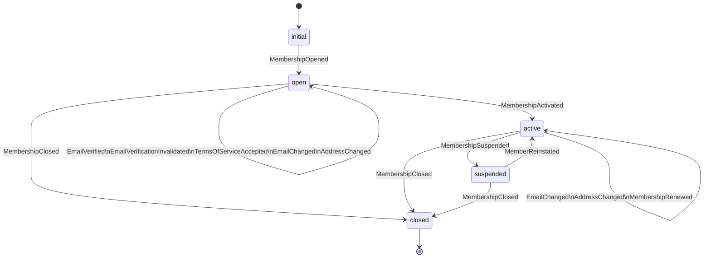

# Session 7: Aggregate, Command, and Policy Structures

## Purpose

Define the precise command/event/policy structures for each bounded context, with full preconditions, emitted events, and intents. This session bridges the domain model and the implementation — everything agreed here maps directly to code.

## Participants

- **Tech Lead**
- **Domain Expert**
- **Product Owner**

## Key Discoveries

- Preconditions on commands (the "specifications") split naturally into two types: **aggregate-level** (does the state allow this command?) and **domain-level** (does the broader domain allow this command?). Keeping them separate makes each independently testable.
- Policies that cross context boundaries are modelled as **integration event reactions** — the upstream context publishes an event; the downstream context subscribes and issues a command to its own aggregate. No context writes to another context's aggregate.
- **Rejection reasons are first-class domain types**, not generic error strings. Each rejection carries enough context for the API layer to return a meaningful, actionable response.

## Membership BC — Full Command Catalogue

### `OpenMembership`

| Field | Value |
|-------|-------|
| **Payload** | `name: Name`, `email: Email` |
| **Preconditions** | No membership exists for this identity |
| **Emits** | `MembershipOpened` |
| **Intents** | `SendEmailVerificationMail(email, verificationToken)` |
| **Rejections** | `MembershipAlreadyExists` |

### `VerifyEmail`

| Field | Value |
|-------|-------|
| **Payload** | `membershipId: MembershipId`, `token: VerificationToken` |
| **Preconditions** | Membership must exist; must not be closed; token must match the current verification token |
| **Emits** | `EmailVerified(verifiedAt: SignedAt)` |
| **Intents** | none |
| **Rejections** | `MembershipNotFound`, `MembershipClosed`, `TokenMismatch` |

### `AcceptTermsOfService`

| Field | Value |
|-------|-------|
| **Payload** | `membershipId: MembershipId`, `version: TosVersion`, `signedAt: SignedAt` |
| **Preconditions** | Membership must exist; must not be closed; TOS version must be known |
| **Emits** | `TermsOfServiceAccepted(version, signedAt)` |
| **Intents** | none |
| **Rejections** | `MembershipNotFound`, `MembershipClosed`, `UnknownTosVersion` |

### `ActivateMembership`

| Field | Value |
|-------|-------|
| **Payload** | `membershipId: MembershipId` |
| **Preconditions** | Membership must exist; must not be closed; must not already be active; email must be verified; ToS must be accepted |
| **Emits** | `MembershipActivated` |
| **Intents** | `SendWelcomeMail(email, name)`, `ListMemberInRegistry(membershipId, name, email)` |
| **Rejections** | `MembershipNotFound`, `MembershipClosed`, `MembershipAlreadyActive`, `EmailNotVerified`, `TermsNotAccepted` |

### `ChangeEmail`

| Field | Value |
|-------|-------|
| **Payload** | `membershipId: MembershipId`, `newEmail: Email` |
| **Preconditions** | Membership must exist; must not be closed |
| **Emits** | `EmailChanged(newEmail)`, `EmailVerificationInvalidated` |
| **Intents** | `SendEmailVerificationMail(newEmail, verificationToken)` |
| **Rejections** | `MembershipNotFound`, `MembershipClosed` |

### `ChangeAddress`

| Field | Value |
|-------|-------|
| **Payload** | `membershipId: MembershipId`, `address: Address` |
| **Preconditions** | Membership must exist; must not be closed |
| **Emits** | `AddressChanged(address)` |
| **Intents** | none |
| **Rejections** | `MembershipNotFound`, `MembershipClosed` |

### `SuspendMembership`

| Field | Value |
|-------|-------|
| **Payload** | `membershipId: MembershipId`, `reason: SuspensionReason` |
| **Preconditions** | Membership must exist; must be in `open` or `active` state; caller must be an authorised system (Payments or Conduct BC) |
| **Emits** | `MembershipSuspended(reason, suspendedAt)` |
| **Intents** | `SendSuspensionNotice(email, reason)` |
| **Rejections** | `MembershipNotFound`, `MembershipAlreadySuspended`, `MembershipClosed`, `NotAuthorised` |

### `ReinstateMembership`

| Field | Value |
|-------|-------|
| **Payload** | `membershipId: MembershipId` |
| **Preconditions** | Membership must be in `suspended` state |
| **Emits** | `MemberReinstated` |
| **Intents** | `SendReinstatementNotice(email)` |
| **Rejections** | `MembershipNotFound`, `MembershipNotSuspended` |

### `CloseMembership`

| Field | Value |
|-------|-------|
| **Payload** | `membershipId: MembershipId` |
| **Preconditions** | Membership must exist; must not already be closed |
| **Emits** | `MembershipClosed` |
| **Intents** | `SendClosureNotice(email)`, `RemoveMemberFromRegistry(membershipId, after: 30 days)` |
| **Rejections** | `MembershipNotFound`, `MembershipAlreadyClosed` |

---

## Key Policies

### Within Membership BC

| Trigger | Policy | Action |
|---------|--------|--------|
| `MembershipOpened` | Send verification | Emit `SendEmailVerificationMail` intent |
| `EmailChanged` | Invalidate verification | Emit `EmailVerificationInvalidated` in same decide step |
| `EmailChanged` | Re-send verification | Emit `SendEmailVerificationMail` intent |
| `MembershipActivated` | Onboard member | Emit `SendWelcomeMail` and `ListMemberInRegistry` intents |
| `MembershipClosed` | Offboard member | Emit `SendClosureNotice` and `RemoveMemberFromRegistry` intents |

### Cross-Context Policies

| Source event | Source BC | Target BC | Action |
|-------------|----------|----------|--------|
| `SanctionIssued` | Conduct | Membership | Issue `SuspendMembership` command (via ACL) |
| `AppealDecided` (upheld) | Conduct | Membership | Issue `ReinstateMembership` command (via ACL) |
| `PaymentFailed` ×3 | Payments | Membership | Issue `SuspendMembership` command |
| `SubscriptionRenewed` | Payments | Membership | Issue `RenewMembership` command |
| `MembershipActivated` | Membership | CPD | Create initial `CPDRecord` for current period |
| `MembershipClosed` | Membership | Accreditation | Issue `RevokeCertification` for all active certs |
| `CertificationAwarded` | Accreditation | Public Registry | Update `MemberProfile` with certification badge |

---

## Membership BC — State Machine

## Contested Areas & Alternatives Considered

| Area | Alternative A | Alternative B | Decision |
|------|--------------|--------------|---------|
| Rejection types | Generic `Error` with string message | Typed rejections per command | **Typed rejections** — enables precise API error responses and exhaustive handling in tests |
| `ActivateMembership` preconditions | Check in handler before calling decide | Check inside decide function | **Inside decide** — keeps business rules in the pure function; handler deals only with I/O |
| Cross-context commands | Direct method calls between BC handlers | Integration events + ACL adapters | **Integration events** — preserves autonomy; each BC controls its own write path |
| `SuspendMembership` authorisation | No authorisation check (trust callers) | Caller identity embedded in command metadata | **Caller identity in metadata** — commands carry `source` in metadata; decide rejects unauthorised sources |

## What This Led To

With command structures formalised, the team ran a Value Stream Mapping exercise to identify where automation reduces manual effort and wait time. See `08-value-stream-mapping.md`.
