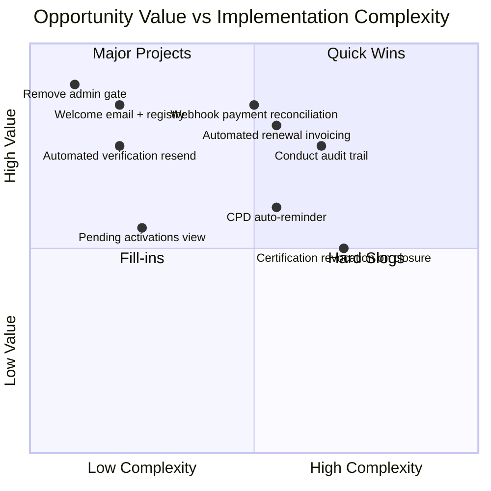

# Session 9: Opportunity Mapping

## Purpose

Map the waste and pain points identified in the Value Stream to concrete software opportunities, and assess each for implementation complexity, business value, and fit with the event-sourced architecture. Prioritise the opportunities into a delivery sequence.

## Participants

- **Product Owner**
- **Tech Lead**
- **Domain Expert**

## Key Discoveries

- Most high-value opportunities are **event-driven automations** — they require no new user interfaces, only new policies that react to existing domain events. This is the architectural pattern that event sourcing makes cheapest.
- The **read model strategy** unlocks several opportunities at once. `PendingActivations` and `CPDProgress` projections give admins and members visibility that currently requires manual queries.
- **Cross-context automation** (e.g. CPD auto-reminder, certification revocation on closure) requires the integration event infrastructure to be in place first. These are dependencies, not blockers — they can be delivered as soon as the subscribing context has its event bus connected.

## Opportunity Map

### O1: Automated verification email resend
**Eliminates:** W2 — manual resend for unverified members  
**Trigger:** 48 hours after `MembershipOpened` or `EmailChanged` with no subsequent `EmailVerified`  
**Implementation:** Time-based policy in Membership BC; re-emits `SendEmailVerificationMail` intent  
**Value:** High — directly reduces abandonment  
**Complexity:** Low — new policy, no new aggregate changes  
**Event sourcing fit:** Excellent — the event store makes "has EmailVerified occurred since MembershipOpened?" trivially queryable

---

### O2: Remove manual admin activation gate
**Eliminates:** W4 — 1–5 day manual approval delay  
**Implementation:** `ActivateMembership` command becomes self-service; the three-gate specification (email + ToS) is the quality control  
**Value:** High — eliminates the single largest delay in onboarding  
**Complexity:** Low — the specification already encodes the rules; removing the manual step is a process change, not a code change  
**Event sourcing fit:** Excellent — `decide` enforces the preconditions; no manual step needed

---

### O3: Event-driven welcome email and registry listing
**Eliminates:** W5, W6 — manual welcome email and registry data entry  
**Trigger:** `MembershipActivated`  
**Implementation:** Intents `SendWelcomeMail` and `ListMemberInRegistry` emitted in the `decide` function for `ActivateMembership`; fulfilled via outbox relays  
**Value:** High — removes admin overhead and makes onboarding instant  
**Complexity:** Low — the intent/outbox pattern is already modelled  
**Event sourcing fit:** Excellent — the outbox pattern is a native part of the architecture

---

### O4: Automated renewal invoicing
**Eliminates:** W7, W8 — late renewal reminders and manual invoice creation  
**Trigger:** 30 days before subscription period end  
**Implementation:** Time-based policy in Payments BC; emits `InvoiceRaised` and triggers `SendRenewalNotice` intent  
**Value:** High — directly reduces member lapse rate  
**Complexity:** Medium — requires the Payments BC and its subscription aggregate to be built  
**Event sourcing fit:** Good — the subscription period is stored as event data; the policy reads it for scheduling

---

### O5: Webhook-driven payment reconciliation
**Eliminates:** W9, W10 — manual reconciliation and manual renewal confirmation  
**Trigger:** Payment gateway webhook → `PaymentReceived` or `PaymentFailed` event in Payments BC → `MembershipRenewed` command  
**Implementation:** Inbound webhook adapter in Payments BC; integration event to Membership BC  
**Value:** High — removes the most labour-intensive recurring admin task  
**Complexity:** Medium — requires payment gateway integration  
**Event sourcing fit:** Excellent — webhook events map directly to domain events

---

### O6: Pending activations read model
**Eliminates:** W1 — no visibility into incomplete registrations  
**Implementation:** `PendingActivations` projector subscribes to `MembershipOpened`, `EmailVerified`, `TermsOfServiceAccepted`, `MembershipActivated`; builds a view showing funnel position per open membership  
**Value:** Medium — operational visibility for admins  
**Complexity:** Low — a projector over existing events  
**Event sourcing fit:** Excellent — projections are the canonical way to build read models from events

---

### O7: CPD auto-reminder
**Eliminates:** Unmodelled — members unaware of CPD requirement status  
**Trigger:** `CPDPeriodEnding` (30 days before close) with no `CPDRequirementFulfilled`  
**Implementation:** Time-based policy in CPD BC; emits `SendCPDReminderNotice` intent to Notifications BC  
**Value:** Medium — improves member engagement and reduces CPD failures  
**Complexity:** Low — once CPD BC is built  
**Event sourcing fit:** Good

---

### O8: Event-sourced audit trail for conduct investigations
**Eliminates:** Unmodelled — currently no reliable audit trail for conduct cases  
**Implementation:** Complaint aggregate event-sourced; full history of investigation, hearing, and decision steps is replayable  
**Value:** High — legally required for professional bodies  
**Complexity:** Medium — requires Conduct BC to be built  
**Event sourcing fit:** Excellent — event sourcing is the right tool for audit-critical processes

---

### O9: Certification revocation on membership closure
**Eliminates:** Hotspot H8 — certifications persisting post-closure  
**Trigger:** `MembershipClosed` integration event consumed by Accreditation BC  
**Implementation:** Accreditation subscribes to `MembershipClosed`; issues `RevokeCertification` for all active certifications held by the closed member  
**Value:** Medium — correctness requirement, not UX improvement  
**Complexity:** Low — once integration event infrastructure is in place  
**Event sourcing fit:** Excellent — cross-context event reaction is the native pattern

---

## Prioritised Delivery Sequence

| Priority | Opportunity | Reason |
|----------|------------|--------|
| 1 | O2 — Remove admin activation gate | Highest-impact, zero-complexity; pure process change |
| 2 | O3 — Welcome email + registry listing | Completes the activation flow; low complexity |
| 3 | O1 — Automated verification resend | Reduces abandonment; low complexity |
| 4 | O6 — Pending activations read model | Unlocks operational visibility early |
| 5 | O5 — Webhook payment reconciliation | Highest admin ROI; unblocks renewal automation |
| 6 | O4 — Automated renewal invoicing | Requires Payments BC; high lapse-prevention value |
| 7 | O7 — CPD auto-reminder | Requires CPD BC |
| 8 | O8 — Conduct audit trail | Requires Conduct BC; legally required |
| 9 | O9 — Certification revocation on closure | Requires both Accreditation and integration events |

## What This Led To

With opportunities mapped and sequenced, the team moved to formalising how the bounded contexts integrate with each other. See `10-context-mapping.md`.
