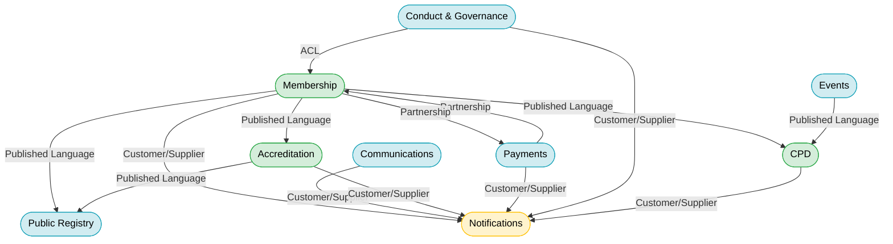

# Session 10: Context Mapping

## Purpose

Define the integration patterns between the nine bounded contexts. For each relationship, agree on who is upstream (provider) and downstream (consumer), what the integration contract looks like, and how context autonomy is preserved.

## Participants

- **Tech Lead**
- **Platform Architect**
- **Domain Expert**

## Key Discoveries

- **Membership is the root identity context** — every other context that cares about a member is downstream of it. No context can act on a member that Membership does not know about.
- The **Notifications context is a pure generic subdomain** — it has no upstream dependencies and every other context is its upstream. This makes it independently deployable and replaceable.
- The **Payments ↔ Membership relationship** was the most difficult to model because it is bidirectional: Membership depends on payment confirmation for activation, but Payments depends on Membership events to know what to invoice. Resolution: the dependency is temporal, not structural — Payments raises invoices based on `MembershipActivated`; Membership activates based on `PaymentReceived`. No circular runtime coupling.
- **Anti-Corruption Layers (ACLs)** are required wherever a downstream context must translate an upstream context's events into its own commands. The Conduct → Membership integration is a clear example.

## Integration Patterns Reference

| Pattern | Meaning |
|---------|---------|
| **Customer/Supplier** | Downstream (customer) negotiates with upstream (supplier) on the contract; upstream can evolve with care |
| **Published Language** | Upstream publishes a well-documented shared schema; downstream translates to its own model |
| **Conformist** | Downstream adopts the upstream model without translation — convenient but creates coupling |
| **ACL (Anti-Corruption Layer)** | Downstream wraps the upstream interface to translate and protect its own model |
| **Open Host Service** | Upstream provides a stable, versioned API for multiple downstreams |
| **Shared Kernel** | Two contexts share a small, jointly-owned model — use sparingly |

## Context Map

### Membership → Notifications

| Attribute | Value |
|-----------|-------|
| **Pattern** | Customer/Supplier |
| **Direction** | Membership is upstream; Notifications is downstream |
| **Contract** | Membership emits typed intents (`SendEmailVerificationMail`, `SendWelcomeMail`, `SendClosureNotice`) to the `IntentOutbox`. Notifications fulfils them via outbound adapters (relays). |
| **Coupling** | Loose — Membership only knows the intent shape, not the delivery mechanism |
| **Evolution** | New intent types can be added to Membership without changing Notifications' core; Notifications adds a new relay |

---

### Membership → Public Registry

| Attribute | Value |
|-----------|-------|
| **Pattern** | Published Language |
| **Direction** | Membership is upstream; Public Registry is downstream |
| **Contract** | Membership publishes `MembershipActivated`, `EmailChanged`, `AddressChanged`, `MembershipClosed`. Public Registry subscribes and maintains its `MemberProfile` projection. |
| **Coupling** | Published Language — Registry translates event payloads to its own model |
| **Evolution** | Registry is insulated from Membership internals; only published event shapes matter |

---

### Membership → Accreditation

| Attribute | Value |
|-----------|-------|
| **Pattern** | Published Language |
| **Direction** | Membership is upstream; Accreditation is downstream |
| **Contract** | Accreditation subscribes to `MembershipActivated` (enables assessment requests) and `MembershipClosed` (triggers certification revocation). |
| **Coupling** | Loose — Accreditation acts on published events, not on Membership internals |

---

### Membership → CPD

| Attribute | Value |
|-----------|-------|
| **Pattern** | Published Language |
| **Direction** | Membership is upstream; CPD is downstream |
| **Contract** | CPD subscribes to `MembershipActivated` (creates the first `CPDRecord`) and `MembershipClosed` (closes the current CPD period without fulfilment). |

---

### Payments ↔ Membership

| Attribute | Value |
|-----------|-------|
| **Pattern** | Partnership |
| **Direction** | Bidirectional — each is upstream of the other in different flows |
| **Contract (Payments → Membership)** | Payments publishes `PaymentReceived` (for activation and renewal) and `PaymentFailed` ×3 (for suspension). Membership subscribes via ACL. |
| **Contract (Membership → Payments)** | Membership publishes `MembershipActivated` (start subscription) and `MembershipClosed` (cancel subscription). Payments subscribes. |
| **Coupling** | Partnership — both teams must coordinate on event shapes. Each context uses an ACL adapter on the receiving side. |
| **Risk** | Bidirectionality requires careful orchestration to avoid race conditions on activation (payment and ToS acceptance can arrive in either order). Resolution: `ActivateMembership` is always member-initiated after both gates are met. |

---

### Conduct → Membership

| Attribute | Value |
|-----------|-------|
| **Pattern** | Customer/Supplier + ACL |
| **Direction** | Conduct is the customer; Membership is the supplier |
| **Contract** | Conduct publishes `SanctionIssued` integration event. An ACL adapter in Membership translates this into a `SuspendMembership` command on the Membership aggregate. |
| **Coupling** | ACL protects Membership from changes in Conduct's event schema |
| **Authorisation** | `SuspendMembership` requires `source: 'Conduct'` or `source: 'Payments'` in command metadata; Membership rejects the command otherwise |

---

### Communications → Notifications

| Attribute | Value |
|-----------|-------|
| **Pattern** | Customer/Supplier |
| **Direction** | Communications is upstream; Notifications is downstream |
| **Contract** | Communications emits `SendNewsletterIntent`, `SendAnnouncementIntent` to the `IntentOutbox`. Notifications fulfils delivery. |

---

### Accreditation → Public Registry

| Attribute | Value |
|-----------|-------|
| **Pattern** | Published Language |
| **Direction** | Accreditation is upstream; Public Registry is downstream |
| **Contract** | Registry subscribes to `CertificationAwarded` and `CertificationRevoked` to maintain `CertificationBadge` on member profiles. |

---

### Events → CPD

| Attribute | Value |
|-----------|-------|
| **Pattern** | Published Language |
| **Direction** | Events is upstream; CPD is downstream |
| **Contract** | CPD subscribes to `AttendanceConfirmed`. If the event qualifies for CPD points, CPD automatically creates a pre-approved `CPDActivity`. |

---

## Context Map Diagram

## Contested Areas & Alternatives Considered

| Area | Alternative A | Alternative B | Decision |
|------|--------------|--------------|---------|
| Payments ↔ Membership | Shared kernel for shared concepts | Separate models with ACL | **Separate models** — invoice and membership are distinct concepts; forced sharing would conflate them |
| Conduct → Membership | Conduct writes directly to Membership's event store | Conduct publishes event; Membership consumes | **Publish + consume** — Membership owns its own event store; no context writes to another's store |
| Notifications coupling | Each context sends email directly | All intents routed via Notifications BC | **Centrally routed** — single delivery contract, single retry strategy, single unsubscribe mechanism |
| Events → CPD | Events BC creates CPD activities | CPD subscribes to Events and decides independently | **CPD subscribes** — CPD decides what counts as a qualifying activity; Events BC has no CPD knowledge |

## What This Led To

With integration patterns defined, the team had everything needed to specify the event sourcing design for the Membership BC in detail. See `11-event-sourcing-design.md`.
