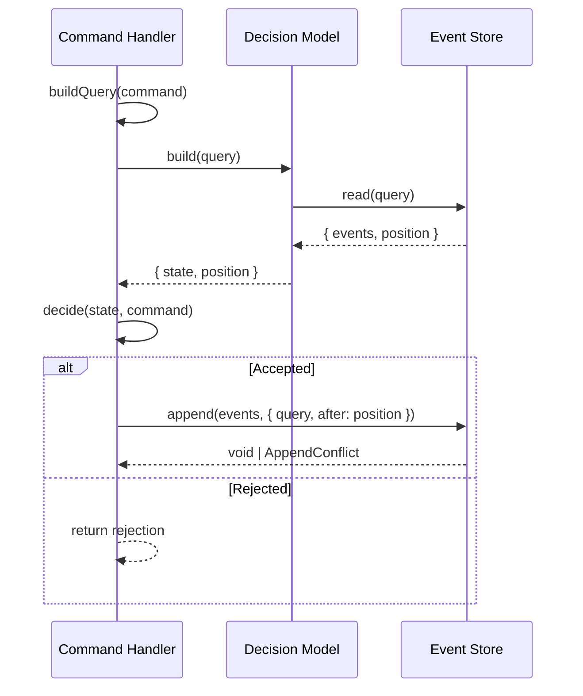

# ADR-0014: Dynamic Consistency Boundaries

## Context and Problem Statement

The command side bound every event to a single aggregate (`aggregateType` + `aggregateId`),
persisted per-aggregate streams (`streamKey`, `streamVersion`), and controlled concurrency with
`Command.expectedVersion`. This fixes the consistency boundary at design time: an invariant that
spans two entities forces either an oversized aggregate or a saga, and a single event can only ever
belong to one boundary. How should a command decide and protect an invariant whose scope is chosen
per decision rather than baked into an aggregate?

## Decision Drivers

* Enforce invariants that span more than one entity without inflating aggregate size.
* Let a single event participate in several consistency boundaries at once.
* Keep optimistic concurrency without a per-aggregate version counter.
* Preserve the existing read side (projector, checkpoints, `loadFrom`) untouched.

## Considered Options

1. Keep aggregate streams and `expectedVersion` (status quo).
2. Keep per-aggregate streams and add sagas for cross-aggregate invariants.
3. Dynamic Consistency Boundaries: tag events, select them with a query, append under a query+position condition.

## Decision Outcome

Chosen option: "Dynamic Consistency Boundaries", because it lets each command define its own boundary
as a query over tagged events and enforces consistency with a query-scoped append condition, removing
the aggregate as the unit of consistency entirely.

A `DomainEvent` (and `Command`, `Intent`, `Notification`) now carries `tags: Tag[]` where
`Tag = { key, value }` instead of aggregate coordinates. A command derives a `DcbQuery` — a disjunction
of criteria, each criterion AND-ing tags and OR-ing types. The handler reads the events inside that
boundary together with the store-wide `position` (the high-water `globalPosition`), folds them through
`evolve` into a decision state, and calls the pure decider. On an Accepted decision it appends the new
events under an `AppendCondition { query, after: position }`; the store rejects the append with an
`AppendConflict` if any event matching the query was stored after `position`. Events are also tagged
with their `commandId`, which lets a retried command be deduplicated through the same mechanism.

### Consequences

* Good, because cross-entity invariants are expressible without a large aggregate or a saga.
* Good, because optimistic concurrency is query-scoped, replacing `expectedVersion` and per-stream versions.
* Good, because the read side (`loadFrom`, checkpoints, projector) is unchanged — `globalPosition` already existed.
* Bad, because correctness depends on an atomic check-then-append; the in-memory store gets this from a single synchronous turn, but a real store needs serializable isolation or a conditional write.
* Neutral, because the subject identifier now travels as a tag, so read models recover it from tags (`subjectOf`) rather than from `aggregateId`.

### Confirmation

* The event store exposes `read(query)` returning `{ events, position }` and a conditional `append(events, condition)`.
* `APPEND_CONDITION_FAILED` is exercised by `EventStore.InMemory.spec.ts` and `decisionModel.test.ts`; a read between an unrelated append and a scoped append is shown not to conflict.
* `loadFrom`/checkpoint behaviour is unchanged and covered by `projector.test.ts`.
* The whole `examples/` suite keeps 100% line/branch/function/statement coverage.

## Pros and Cons of the Options

### Keep aggregate streams and `expectedVersion`

* Good, because it is the simplest model and already implemented.
* Neutral, because it matches classic DDD aggregate guidance.
* Bad, because cross-entity invariants need an oversized aggregate, and one event cannot span boundaries.

### Per-aggregate streams plus sagas

* Good, because it keeps small aggregates.
* Neutral, because sagas are a well-known pattern.
* Bad, because cross-entity invariants become eventually consistent and add saga state, compensation, and complexity.

### Dynamic Consistency Boundaries

* Good, because the boundary is chosen per decision and an event can belong to many boundaries.
* Good, because concurrency control is uniform and query-scoped.
* Bad, because it requires an atomic conditional append and a tag/query model that is less familiar than aggregates.

## Diagram

## More Information

Supersedes **ADR-0005** (command handling pattern): the lifecycle becomes
buildQuery → read+fold → decide → conditional append, and `LoadAggregateState`/`expectedVersion` are
removed in favour of `BuildDecisionModel`/`AppendCondition`.

Amends **ADR-0013** (event store read model): `LoadDomainEvents` and `LoadEventStreamFrom` are removed,
`StoredEvent` drops `stream`/`streamKey`/`streamVersion`, and the event-relay partition key (ADR-0009)
derives from a designated subject tag rather than `aggregateId`.

Relates to **ADR-0012** (specification pattern): specifications still evaluate the folded decision
state and are unchanged; and to **ADR-0003** (intent/outbox): intents and notifications identify their
subject through tags. Concept after Sara Pellegrini and Milan Savić, "Kill the Aggregate".
