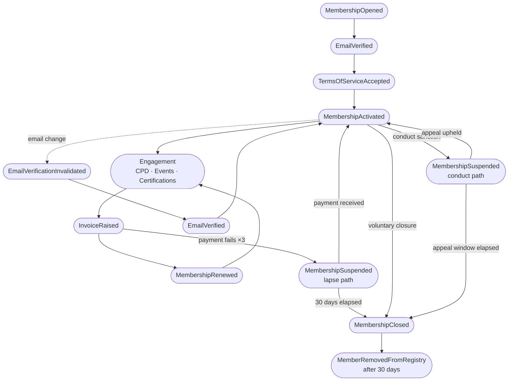

# Session 4: Shared Domain Event Timeline

## Purpose

Construct a single chronological timeline of domain events for a representative member journey from first registration to eventual exit. This gives every participant a shared reference point and surfaces the sequences, gaps, and branch points that would otherwise stay invisible in isolated flow diagrams.

## Participants

- **Domain Expert**
- **Tech Lead**
- **Product Owner**

## Key Discoveries

- The gap between `MembershipOpened` and `MembershipActivated` can span hours (a fast user) or weeks (a procrastinating one). The domain must tolerate long-lived partial state gracefully.
- **EmailVerificationInvalidated** is an underappreciated event — it appears both on email change and, implicitly, any time the verification token expires. The token expiry case was an unmodelled hotspot.
- The **annual renewal cycle** creates a recurring loop in the timeline. The model must handle members who have been through multiple renewals without accumulating stale state.
- Two distinct exit paths emerged: **voluntary closure** (member-initiated, immediate) and **lapse** (policy-initiated, gradual — payment failure → suspension → closure). A third path — **conduct closure** — follows a similar gradual pattern but via the Conduct BC.

## Artefacts

### Happy Path: Alice joins the IDC and grows as a member

```
T+0m     MembershipOpened           Alice registers with name and email
T+0m     [Intent] SendEmailVerificationMail
T+5m     EmailVerified              Alice clicks the verification link
T+10m    TermsOfServiceAccepted     Alice accepts ToS v2024.1
T+10m    MembershipActivated
T+10m    [Intent] SendWelcomeMail
T+10m    MemberListedInRegistry

T+2w     CPDActivitySubmitted       Alice logs attendance at a local meetup
T+2w     CPDActivityApproved

T+3mo    AssessmentRequested        Alice applies for IDC Associate level
T+3mo    AssessmentScheduled
T+4mo    AssessmentCompleted        Pass
T+4mo    CertificationAwarded       IDC Associate
T+4mo    CertificationDisplayedOnProfile

T+11mo   InvoiceRaised              Annual renewal invoice
T+11mo   [Intent] SendRenewalNotice
T+12mo   PaymentReceived
T+12mo   MembershipRenewed

T+18mo   CPDRequirementFulfilled    Alice completes the annual CPD requirement
T+24mo   CPDPeriodClosed
```

### Branch A: Email change mid-journey

```
T+6mo    ChangeEmail command issued
T+6mo    EmailChanged
T+6mo    EmailVerificationInvalidated
T+6mo    [Intent] SendEmailVerificationMail
T+6mo    EmailVerified              Alice verifies new email
```

### Branch B: Payment lapse

```
T+11mo   InvoiceRaised
T+12mo   PaymentFailed              First attempt
T+15mo   PaymentFailed              Second attempt (3-day retry)
T+18mo   PaymentFailed              Third attempt (3-day retry)
T+18mo   MembershipSuspended        Grace period exhausted
T+48mo   MembershipClosed           30 days suspended with no payment
T+48mo   MemberRemovedFromRegistry
```

### Branch C: Voluntary closure

```
T+24mo   CloseMembership command issued (member-initiated)
T+24mo   MembershipClosed
T+54mo   MemberRemovedFromRegistry  30-day grace period for profile visibility
```

### Branch D: Conduct closure

```
T+18mo   ComplaintRaised            Complaint filed against Alice
T+18mo   ComplaintInvestigated
T+19mo   HearingScheduled
T+20mo   SanctionIssued             Committee decision: closure
T+20mo   MemberSuspended            Immediate suspension pending appeal window
T+21mo   MembershipClosed           Appeal window elapsed with no appeal
T+21mo   MemberRemovedFromRegistry
T+21mo   CertificationRevoked
```

### Branch E: Appeal after sanction

```
T+20mo   SanctionIssued
T+20mo   MemberSuspended
T+20mo   AppealSubmitted            Alice submits appeal within 14-day window
T+21mo   AppealDecided              Appeal upheld
T+21mo   MemberReinstated
```



## Contested Areas & Alternatives Considered

| Area | Alternative A | Alternative B | Decision |
|------|--------------|--------------|---------|
| Registry removal on closure | Immediate | After grace period | **Grace period (30 days)** — allows members to notify contacts; configurable |
| Certification on closure | Remain valid | Voided immediately | **Voided** — IDC certification implies active standing; historical record preserved |
| Token expiry modelling | Not modelled (infrastructure concern) | `VerificationTokenExpired` domain event | **Deferred** — treated as infrastructure for now; flagged as hotspot |
| Suspension reversibility | Once suspended, always progresses to closure | Suspension can be lifted by member action (e.g. payment) | **Liftable** — payment reinstates on lapse path; only conduct closure is irreversible without appeal |

## What This Led To

The timeline exposed several ambiguities and edge cases that were not visible in the process flows. These were captured as hotspots. See `05-hotspots.md`.
